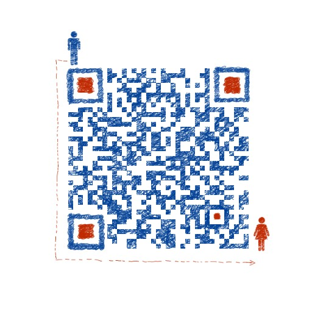

## MD

#### 一套针对*陌生人匿名社交*的系统，包括管理平台，服务器系统，各平台（Android，iOS，网页，PC）客户端系统。

### 版本号说明
暂无版本号

木丁（MD）项目的开源文档，包含但不限于以下内容：
1. 软件需求说明书
2. 软件详细设计文档
3. 商业计划书
4. 其他相关文档

项目人员，包含但不限于以下人员：
1. 项目主管：李超众
2. 系统开发(美工，设计，编码)：李超众
3. 系统测试(单元测试，集成测试)：李超众
4. 系统部署：李超众
5. 后期维护：李超众
6. 宣传策划：李超众

预期项目上线时间：**2018.11**

预期项目花费：$10,000,000,000

任何人对开源文档提供的有益修改将**不会**得到任何奖励

 文档允许以学习为目的无偿使用，也允许他人依据文档进行自主开发，但是该文档的任何传播行为都必须是无偿的。

**作者联系方式(合作开发 备注：github文档)**

**感谢作者**

     
